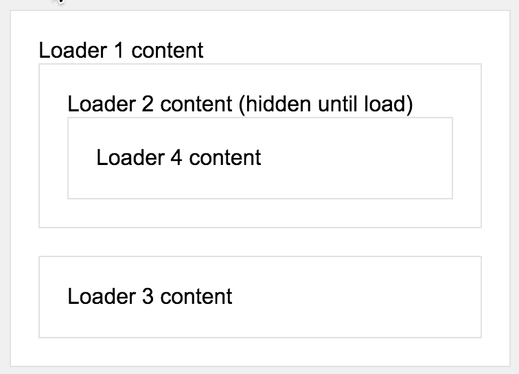

# react-loader-advanced

[](https://badge.fury.io/js/react-loader-advanced)
[](https://npmjs.org/package/react-loader-advanced)

> Show loader overlaying your component during async events.

React-loader-advanced provides a component into which you can wrap
an arbitrary React component. The loader will fill the area of the component
and display a loading message. You may need multiple loader containers
at different parts of your page. This loader also supports setting priority
for the loaders so that the lower priority loaders will never show if
there is another loader already showing. This is beneficial when you want to
prevent transparent loaders overlapping, which would look ugly.

[Demo](http://nygardk.github.io/react-loader-advanced/)



## Install

```shell
npm install react-loader-advanced --save
```
## Compatibility

Compatible with React versions `0.13.x`, `0.14.x`, `^15.0.0` and `^16.0.0`.

## Usage

__1. Include Loader__

Node:
```js
import Loader from 'react-loader-advanced';
```

__2. Wrap your component inside the loader__
```jsx
<Loader show={true} message={'loading'}>
  <SomeComponent />
</Loader>
```
__3. Style the loader using foregroundStyle and backgroundStyle__

```jsx
<Loader foregroundStyle={{color: 'white'}}
  backgroundStyle={{backgroundColor: 'black'}}>
...
```

You may optionally disable all default styling by setting property
*`disableDefaultStyles`* to `true`.


__4. Optionally if you wish, hack the loader using CSS styles
knowing the class-hierarchy__

```html
<div class="Loader__background">
  <div class="Loader__foreground">
    <div class="Loader__message">
      Loading
    </div>
  </div>
</div>
```

See more thorough structure in `./src/react-loader-advanced.js`.

## Options (props)

__show__ (bool)
<br>
This is the only required prop.
When _true_, loader overlay is displayed.
When _false_, only actual content is displayed.

__priority__ (int)
<br>
The loader(s) with the highest priority will always be the only loader(s)
showing. If loaders with lower priorities stop loading before the one with
the highest priority, they will never be shown.
Default priority is 0.

__hideContentOnLoad__ (bool)
<br>
Hide content underneath loader overlay when loading.

__contentBlur__ (int = px)
<br>
Blur the background on browsers that support CSS filter().

__message__ (node = element|string)
<br>
Set the displayed message on foreground while loading.
Can be an arbitrary element like a spinner of your choice
-- or just a simple string. Defaults to string "loading...".

__messageStyle__ (obj)
<br />
Extends the message element style.

__foregroundStyle__ (obj)
<br>
Set a style for the loader foreground.
Extends default styles.

__backgroundStyle__ (obj)
<br>
Set a style for the loader background.
Extends default styles.

__contentStyle__ (obj)
<br />
Extends the content wrapper element style.

__disableDefaultStyles__ (bool)
<br>
Disables default styles for background, foreground and message if set
to _true_ (not recommended).

__transitionConfig__ (object)
<br>
Configure `ReactCSSTransitionGroup` for the loader overlay to add e.g. fade animation.
See: [react-transition-group](https://github.com/reactjs/react-transition-group)

## FAQ

##### Can I use a spinner element?

Yes, you can define a spinner element in the message-prop.

```jsx
const spinner = <span>any-spinner-you-want</span>;

<Loader message={spinner}>
...
</Loader>
```

## License

MIT
